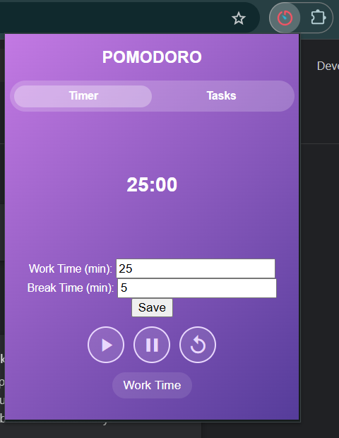
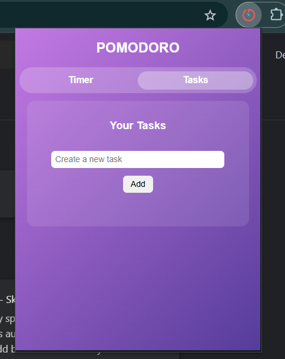

# 🟣 Purple Pomodoro Extension

A simple **Pomodoro Timer** Chrome extension with a **to-do list** for better productivity. This extension allows users to **customize work and break time, save tasks, and receive notifications** when the timer ends.

## 🚀 Features
- ✅ **Customizable Timer** – Set your preferred work and break durations.
- ✅ **Task List** – Add and remove tasks easily.
- ✅ **Auto-Saving** – Timer and tasks persist even after closing the browser.
- ✅ **Notifications** – Get alerts when the work or break session ends.
- ✅ **Minimal & Aesthetic UI** – Inspired by modern productivity tools.

## 📸 Screenshots


---

## 📦 Installation

### 1️⃣ Clone the repository
```bash
git clone https://github.com/your-username/purple-pomodoro.git
cd purple-pomodoro
```
## 2️⃣ Load the extension in Chrome
Open Chrome and go to chrome://extensions/.
Enable Developer Mode (top right corner).
Click Load Unpacked and select the purple-pomodoro folder.
The extension should now appear in your browser!

## 🛠 Usage
Click the Purple Pomodoro Extension icon.
Set your preferred work and break time.
Click Start to begin the timer.
Switch to the Tasks tab to manage your to-do list.
Receive a notification when the timer ends.
## 📂 Project Structure
```bash
Copy
Edit
purple-pomodoro/
│── icons/             # Extension icons
│── styles.css         # UI styling
│── popup.html         # Main HTML file for the extension
│── script.js          # Timer and task functionality
│── manifest.json      # Chrome extension configuration
│── README.md          # Documentation
```
## 👨‍💻 Technologies Used
HTML, CSS, JavaScript
LocalStorage for saving tasks and timer settings
Chrome Extensions API


## 📃 License
This project is licensed under the MIT License – you are free to modify and distribute it.

## 📩 Contact
For any suggestions or issues, feel free to open an issue or reach out at:

📧 k.kov1917@gmail.com

💜 Happy Productivity! 🚀
